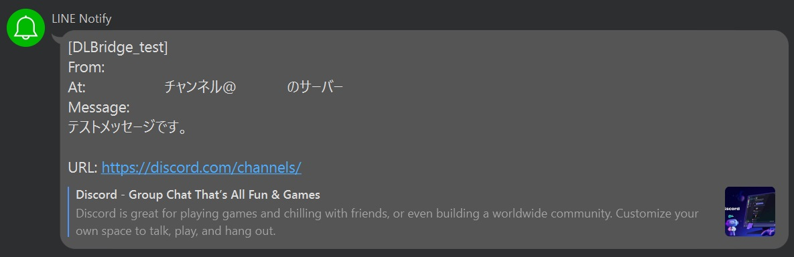
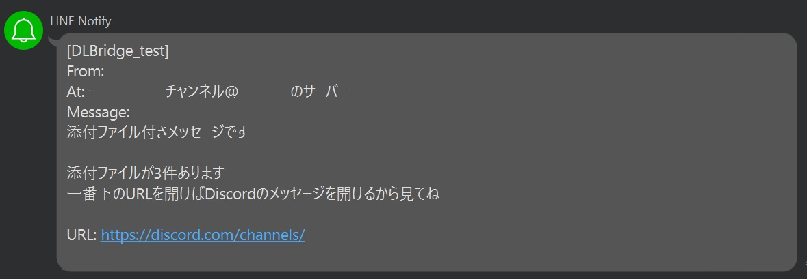
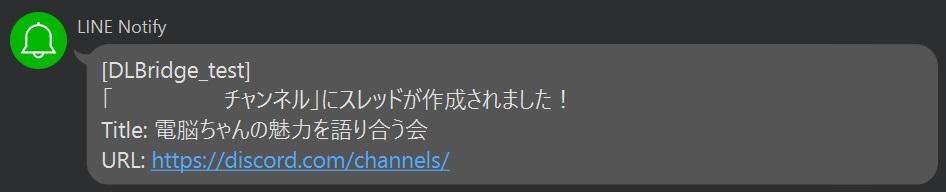
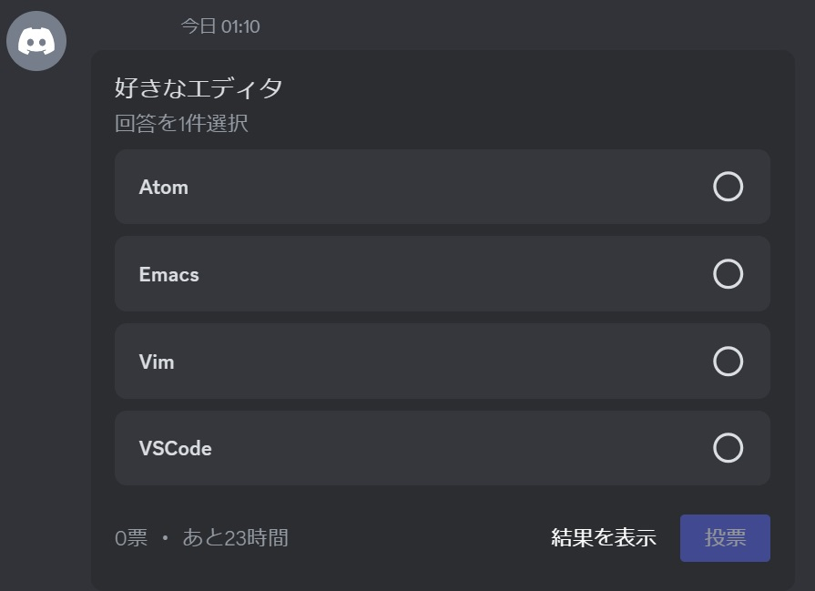
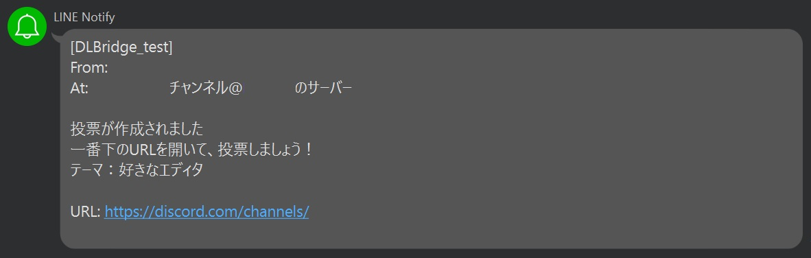

# Dennou DLBridge
Discordの投稿をLINEに垂れ流すDiscordボット。

## 動作例
通常のメッセージ
<br>



添付ファイルがある場合
<br>



スレッドが作成された場合


投票が作成された場合
<br>



## 事前準備
* Python 3のインストール
* このレポジトリの`git clone`
* Discordボットのトークンの発行
* LINE Notifyのトークンの発行

## セットアップ方法
1. レポジトリのクローン先へ移動
2. Python仮想環境の作成・アクティベート
3. 実行に必要なモジュールのインストール
```shell
pip install -r requirements.txt
```
4. `bot`ディレクトリへ移動
5. `.env`ファイルの作成
6. `.env`ファイルを次のように編集
```
DBOT_TOKEN = "発行したDiscordボットのトークン"
```
7. ボットを設定モードで起動
```shell
python3 main.py --setup
```
8. ボットの設定をする。詳細は[bot_setup.md](bot_setup.md)を参照してください。
9. ボットをボットモードで起動
```shell
python3 main.py
```